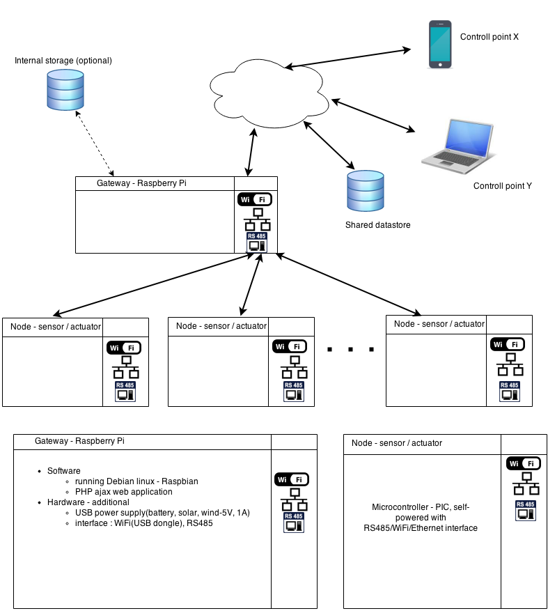

# sensihomeManagement

A scalable IoT solution with data visualisation. Written in PHP/Yii 2. The current codebase was used to 
interact with ESP8266 modules, however, it is very flexible and can be connected with other devices.

##	Idea

##	Look and Feel

